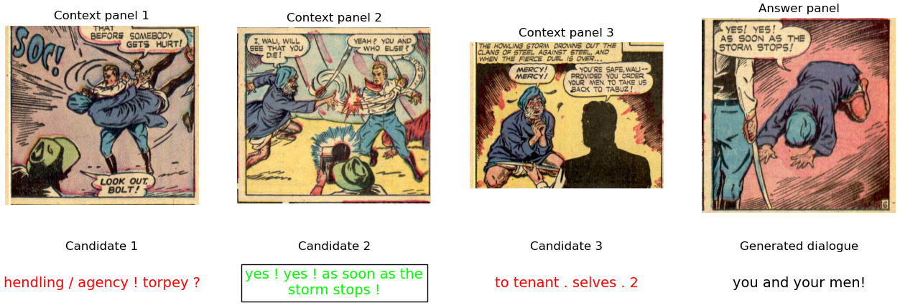

# Automatic generation of comic dialogues
* Author: [Sergi Masip Cabeza](https://sergimasip.com)
* Thesis director: [Ernest Valveny Llobet]()
* Developed as a bachelor's thesis at [Universitat Autònoma de Barcelona](https://www.uab.cat). Check the [thesis](https://ddd.uab.cat/pub/tfg/2021/tfg_132310/1533031_informe_final.pdf) for more information (catalan).




## Project Description
The purpose of this project is to generate subsequent dialogues given a multimodal context. To do this, we used the database provided in [COMICS](https://github.com/miyyer/comics). First, we trained a text-only and a multimodal model to perform a Text cloze task. Then, we trained another based on the previous one for generating dialogues.


## Getting Started

1. Clone this repo (for help see this [tutorial](https://help.github.com/articles/cloning-a-repository/)).

```
git clone https://github.com/Atenrev/comics-dialogue-generation.git
cd comics-dialogue-generation
```

2. Download and prepare the dataset.  

    a. Download our preprocessed version of [COMICS](https://drive.google.com/drive/folders/1kvQ7mWV1IgVzoiIM0xdJhaDCFVVD60OH?usp=sharing) and place it in ```datasets/COMICS```. If you would like to use the original dataset, you can download it from the [COMICS repository](https://github.com/miyyer/comics).

    *Note that there are two files for the test set. The original authors filtered some dialogues from this set based on their tokenizer. To be able to compare the results of our model with the original ones, we maintain this filter in the test set. The "full" version, on the other hand, is not filtered.*

    b. Extract the visual features using Detectron2. Follow the instructions [here](https://github.com/Atenrev/comics-dialogue-generation/tree/master/tools/extract_visual_features) within this repo.

3. Install the dependencies.

```sh
# Create python environment (optional but recommended)
conda create -n comicsgen python=3.9
source activate comicsgen

# Install python dependencies
pip install -r requirements.txt
```

4. [Optional] Download the pre-trained weights (not uploaded yet). If you use the VL-T5 model, download the pretrained weights from their repository [here](https://github.com/j-min/VL-T5).


## Configuration

Every model, dataset, and trainer is configured in a configuration file. The configuration file is a YAML file. The configuration files are located in the ```configs``` folder. In case you want to add a new model, dataset, or trainer, you should create a new configuration file and add it to the ```configs``` folder, as well as the corresponding model or dataset script in ```src```.

### Dataset configuration
For each dataset, you need a configuration file in the ```configs/datasets``` folder. The file must contain the "name" parameter, which is the same as the name of the dataset script in ```src/datasets``` that will be used to load the dataset.

### Model configuration
For each model, you need a configuration file in the ```configs/models``` folder. The name of the file must be the same as the name of the model script in ```src/models``` that will be used to load the model. The file must contain the the following parameters:
``` YAML
classname: <class name of the model>

tokenizer: <name of the tokenizer (we use the AutoTokenizer class from HuggingFace)>
# or
feature_extractor: <name of the feature extractor>
```

### Trainer configuration
For the trainer, you need a configuration file in the ```configs/trainers``` folder. The file must contain the the following parameters:

``` YAML
epochs: <number of epochs>
runs_path: <path to the runs folder>
report_path: <path to the report folder>

optimizer:
    type: <type of optimizer>
    # ... parameters of the optimizer
```

The runs folder is where the training logs will be saved. The report folder is where the evaluation reports will be saved.


## Code structure

```sh
# Run dataset setup and feature extraction
./tools
    extract_visual_features/
    setup_dataset/

# Store dataset
./datasets
    COMICS/
        frcnn_features/
            boxes36.h5
        text_cloze_train_easy.csv
        ...
    ...

# Store pre-trained weights
./pretrained_weights
    vlt5_epoch30.pth                                            <= The VL-T5 model expects this file to be in this folder (you can change this in its config file).
    ...

# Store configuration
./config
    datasets/
    models/
    trainers/

# Create you own models or datasets
.src/
    models/                                               <= This is where you should add your own models. They should inherit from the BaseModel class. 
        base_model.py
    datasets/                                             <= This is where you should add your own datasets. They must inherit from the ```BaseDataset``` class.
        base_dataset.py

# Run the model
./main.py
```


## Training and evaluation

To train the model, run the following command:

```sh
python main.py
  --mode "train"
  --model               Model to run
  --dataset_config      Dataset config to use
  --trainer_config      Trainer params to use
  --dataset_dir         Dataset directory path
  --load_checkpoint     Path to model checkpoint
  --batch_size          Batch size
  --seed                Seed to use
```

To evaluate the model, change the ```--mode``` to "eval".


## Reference
```
@mastersthesis{ddd.uab.cat:264189,
      author = {Masip Cabeza, Sergi and Valveny Llobet, Ernest, dir.},
       title = {Generació automàtica de diàlegs de còmic},
        year = {2022},
         url = {https://ddd.uab.cat/record/264189},
}
```
